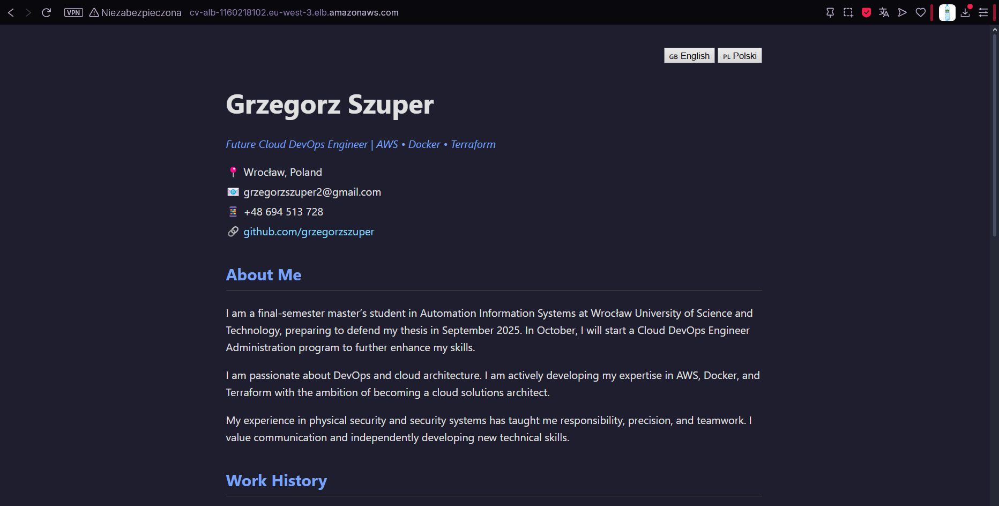
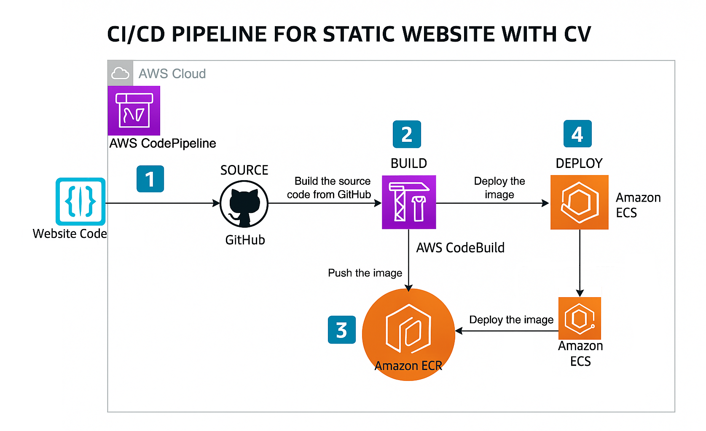
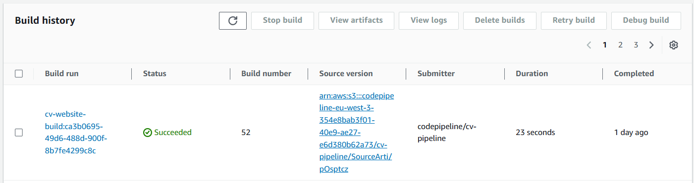
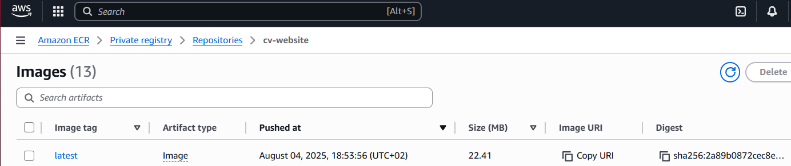
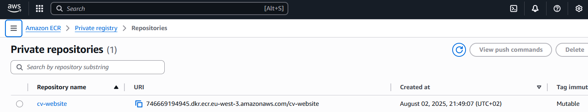
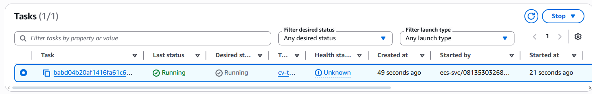
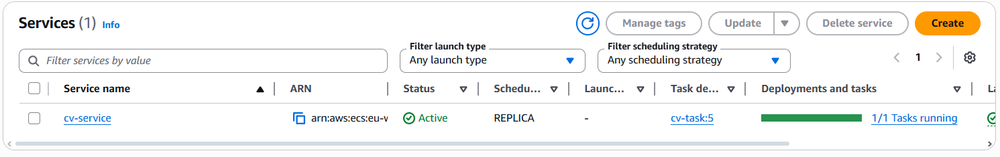

# 🌐 CV Website – Automatic CI/CD Deployment on AWS using Docker & ECS Fargate

This project demonstrates how to automatically deploy a static CV website using Docker containers, AWS services (CodePipeline, ECR, ECS Fargate), and a public Load Balancer. Every push to the GitHub repository triggers a pipeline that builds a new image and deploys the website without any manual intervention.

---

🇬🇧 English | [🇵🇱 Wersja polska](README_PL.md)

---

## 🖼️ Project Preview

### 📄 Final website view:



---

## 🧭 Infrastructure Architecture

The following diagram presents the general infrastructure design:



- The Docker container is deployed on **ECS Fargate**
- Users access it via an **Application Load Balancer (ALB)**
- Images are stored in **Amazon ECR**
- The CI/CD pipeline automatically updates the running version

---

## 🔄 CI/CD Process

1. Source code is hosted on GitHub.
2. AWS CodePipeline detects changes and triggers the process.
3. AWS CodeBuild builds the Docker image and pushes it to Amazon ECR.
4. ECS Fargate deploys the updated container.
5. The website is served publicly via the Load Balancer.

### ✅ CodePipeline overview:


---

## 🚀 Key Features

- Static site hosted in a Docker container
- Fully automated CI/CD with CodePipeline and CodeBuild
- Image registry using Amazon ECR
- Deployment to ECS Fargate (serverless)
- Public access via Application Load Balancer (ALB)

---

## 🛠️ Tech Stack

- **Docker**
- **Amazon ECS (Fargate)**
- **Amazon ECR**
- **AWS CodePipeline**
- **AWS CodeBuild**
- **Application Load Balancer (ALB)**

---

## 📸 AWS Screenshots

### 🏗️ CodeBuild build history:



---

### 📦 Docker image in Amazon ECR:




---

### 🚢 Running ECS task:



---

### ⚙️ ECS Service:



---

### 🌐 Application Load Balancer:


---

## 📁 Project Structure

```txt
📁 Pipeline-for-static-website-with-CV/
├── 📁 screenshots/
│   ├── website-preview.png
│   ├── model.png
│   ├── codepipeline.png
│   ├── codebuild-history.png
│   ├── ecr-images.png
│   ├── ecr-repo.png
│   ├── ecs-task.png
│   ├── ecs-service.png
│   └── alb.png
├── Dockerfile
├── buildspec.yml
├── index.html
├── style.css
└── README.md
