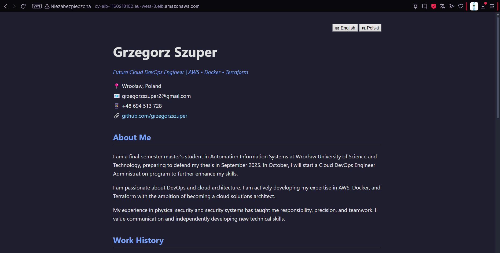
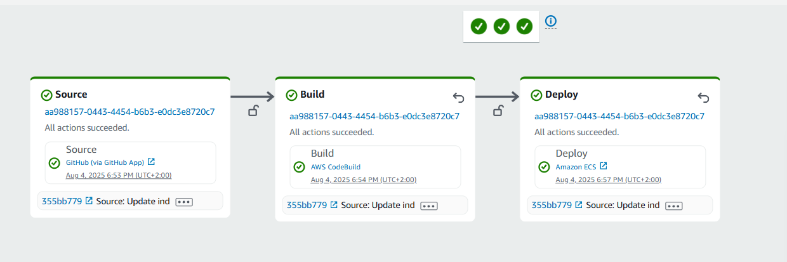
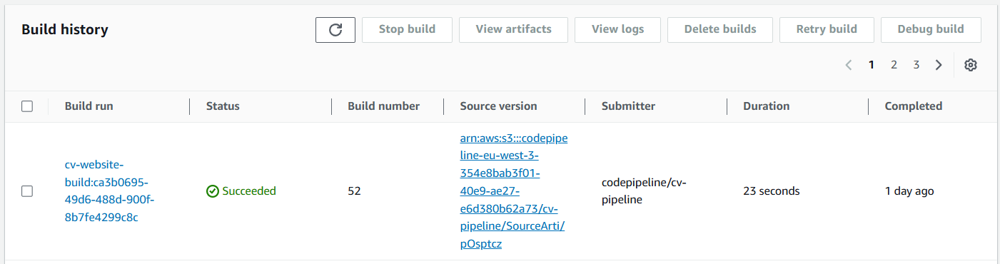
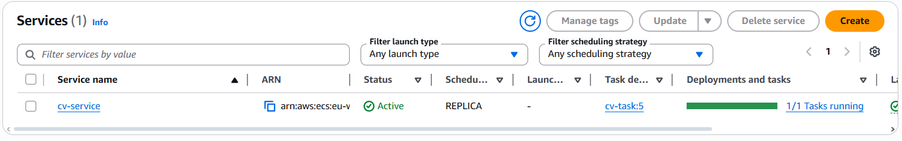

# 🌐 CV Website – Automatyczne wdrażanie (CI/CD) na AWS z Dockerem i ECS Fargate

Ten projekt przedstawia sposób automatycznego wdrażania statycznej strony internetowej (CV) za pomocą kontenera Docker, usług AWS (CodePipeline, ECR, ECS Fargate) oraz publicznego Load Balancera. Po każdej zmianie w repozytorium GitHub uruchamiany jest pipeline, który buduje nowy obraz i wdraża stronę bez potrzeby ręcznej ingerencji.

---

## 🖼️ Podgląd projektu

### 📄 Widok gotowej strony:



---

## 🧭 Architektura rozwiązania

Poniższy diagram przedstawia ogólną architekturę infrastruktury:


- Kontener Docker uruchamiany jest na **ECS Fargate**
- Użytkownicy uzyskują dostęp przez **Application Load Balancer**
- Obrazy przechowywane są w **Amazon ECR**
- Pipeline CI/CD automatycznie aktualizuje wersję

---

## 🔄 Proces CI/CD

1. Kod znajduje się w repozytorium GitHub.
2. AWS CodePipeline wykrywa zmianę i uruchamia proces budowania.
3. CodeBuild tworzy obraz Dockera i wysyła go do Amazon ECR.
4. ECS Fargate wdraża nową wersję kontenera.
5. Strona jest dostępna publicznie przez Load Balancer.

### ✅ Widok pipeline CodePipeline:



---

## 🚀 Główne funkcjonalności

- Hostowanie statycznej strony w kontenerze Docker
- Automatyczne CI/CD z użyciem CodePipeline + CodeBuild
- Przechowywanie obrazów w Amazon ECR
- Deployment na ECS Fargate (bez zarządzania serwerami)
- Publiczny dostęp przez Application Load Balancer (ALB)

---

## 🛠️ Technologie

- **Docker**
- **Amazon ECS (Fargate)**
- **Amazon ECR**
- **AWS CodePipeline**
- **AWS CodeBuild**
- **Application Load Balancer (ALB)**

---

## 📸 Screeny z AWS

### 🏗️ Historia buildów – CodeBuild:



---

### 📦 Obraz Dockera w Amazon ECR:


---

### 🚢 Zadanie uruchomione w ECS Fargate:


---

### ⚙️ Usługa ECS:



---

### 🌐 Load Balancer (ALB):


---

## 📂 Struktura projektu

```txt
📁 Pipeline-for-static-website-with-CV/
├── 📁 screenshots/
│   ├── website-preview.png
│   ├── model.png
│   ├── codepipeline.png
│   ├── codebuild-history.png
│   ├── ecr-images.png
│   ├── ecr-repo.png
│   ├── ecs-task.png
│   ├── ecs-service.png
│   └── alb.png
├── Dockerfile
├── buildspec.yml
├── index.html
├── style.css
└── README.md
